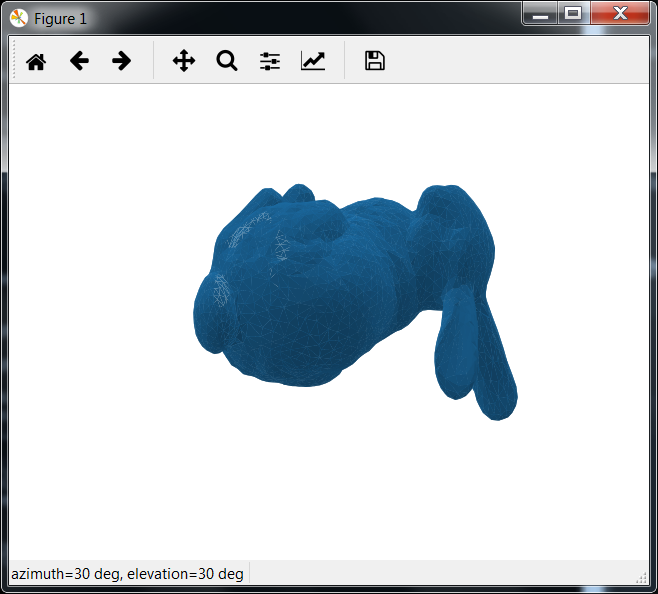
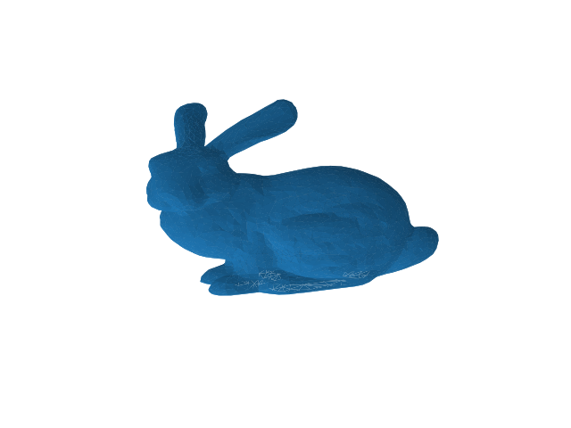
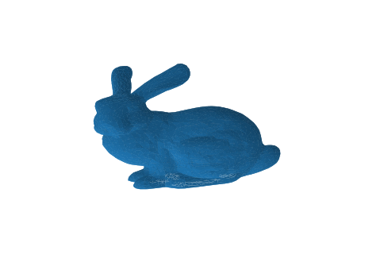

# obj2png - converting 3D triangular mesh to picture file with MatPlotLib

A small python tool for converting 3D triangular mesh to picture file with [MatPlotLib](https://matplotlib.org) 2.2.2 and [Python](https://www.python.org/) 3.6.6 installed with [Anaconda](https://anaconda.org/anaconda)

In the following I have used the [Stanford bunny](http://graphics.stanford.edu/data/3Dscanrep/) (bun_zipper_res2.ply) converted to [WaveFront .obj](https://en.wikipedia.org/wiki/Wavefront_.obj_file) format using [meshconv](http://www.patrickmin.com/meshconv/)

## How to run


```
$ python obj2png.py -i bunny.obj -v
```



Rotate the object to the right position and note the azimuth and elevation numb (stl, ply, ...)ers for example azimuth=-95 elevation=100.

Now create the image:
```
$ python obj2png.py -i bunny.obj -a -95 -e 100
Namespace(animate=False, azim=-95.0, elevation=100.0, objfiles=['bunny.obj'], outfile=None, quality=None, scale=None, view=False)
Converting bunny.obj to bunny.png
```
See result in file bunny.png:




## More detailed help
For more help run

```
$ python obj2png.py --help

usage: obj2png.py [-h] [-i OBJFILES [OBJFILES ...]] [-o OUTFILE] [-a AZIM]
                  [-e ELEVATION] [-q QUALITY] [-s SCALE] [-v] [-A]

Obj to png using MatPlotLib

optional arguments:
  -h, --help            show this help message and exit
  -i OBJFILES [OBJFILES ...], --infiles OBJFILES [OBJFILES ...]
                        File or files to be converted to png
  -o OUTFILE, --outfile OUTFILE
                        Output file(s). Default: infile.png
  -a AZIM, --azimuth AZIM
                        Azimuth angle of view in degrees.
  -e ELEVATION, --elevation ELEVATION
                        Elevation angle of view in degrees.
  -q QUALITY, --quality QUALITY
                        Image quality (HIGH,MEDIUM,LOW). Default: LOW
  -s SCALE, --scale SCALE
                        Scale picture by descreasing boundaries. Lower than 1.
                        gives a larger object.
  -v, --view            View instead of creating picture file.
  -A, --Animate         Animate instead of creating picture file as animation,
                        from elevation -180:180 and azim -180:180
```                      

Note that inputs can be a number of files, eg. -i f1.obj f2.obj` or a glob match eg. `-i *.obj`

## Other output formats

Use --output to use other output file formats

Supported formats with current MatPlotLib (Versoin 2.2.2) are: eps, jpeg, jpg, pdf, pgf, png, ps, raw, rgba, svg, svgz, tif, tiff

I have not put much thought into this but svg may be the better choice than png...

Bunny in svg format below. Zoom in your browser,  say 300%, and compare with the png file above).



## Other input formats (stl, ply, ...)

Use a tool like [meshconv](http://www.patrickmin.com/meshconv/) to convert stl or ply files to obj format, for example:
```
$ meshconv bun_zipper_res2.ply -c obj
```
Supported input file types by meshconv:  dxf obj off ply stl 3ds wrl (VRML 2.0 only)

## Limitations

I have not tested really large files but inputs around 10 Mb seems to work OK. If you have really large files this is not the tool to use; use a professional 3D mesh editing tool.

## How to contribute

Install Python and MatPlotLib, maybe by using Anaconda or by other means. I developed the code using Python 3.6 and have not tested other versions of Python but I think porting to Python 2.7 should be easy.

Clone this repo and hack away.

## Support

I created this project in my spare time for fun and mostly for myself. I uploaded it to github because I was searching for such a tool and did not find anything small and lean. I hope anyone in my shoes will find it useful.

I have no intentions about supporting nor maintaining it. The code is quite trivial and any Python programmer should be able to take it and modify it for whatever use.
